<div align="center">



<br/>

[](https://claude.ai) [](./cognitropy.py) [](.)

<!-- COGNITROPY-STATS-START -->

    

### Project Statistics

| Metric | Value |
|--------|-------|
| Total Workspaces | **12** |
| Categories Covered | **8** |
| Build Streak | **7 days** |
| Project Day | **7** |
| Last Build | **2026-04-01** |
| Categories | Automotive & Engine, Cyber & DFIR, Earth Sciences, Environmental & Earth, Food & Agriculture, Hardware & Embedded, RF/SDR/Signals, Space & Aviation |

<!-- COGNITROPY-STATS-END -->

</div>

Every morning, a Claude agent wakes up and receives a fresh creative challenge — maybe *limnology* (freshwater lake science), maybe *coopering* (barrel-making), maybe *Mars terrain analysis crossed with EVA procedure planning*. Each day is a new domain to explore, a new puzzle to solve. The agent builds a full, professional-grade workspace for whatever the entropy engine surfaces, then pushes it here.

This repo is the result. It grows by one workspace daily, completely autonomously. No human in the loop. Just an AI, an entropy engine, and an ever-expanding collection of workspaces for domains you didn't know you needed.

> Built by [DaxxSec](https://github.com/DaxxSec) & Claude (Anthropic)

---

## The Problem

AI has an entropy problem. Ask it to "pick something creative" a hundred times and you'll get the same handful of safe, predictable ideas. It's the creative equivalent of a random number generator with a bad seed — low entropy, repetitive output.

**Cognitropy** (cognition + entropy) is our answer.

> **A note on the terminology:** Yes, we made up a word. Two, actually. **Cognitropy** = cognition + entropy — the injection of unpredictability into AI creative processes. **Cognitropic** = the adjective form, describing structures that *direct* that entropy toward cognition (following the Greek *-tropos*, "turning toward" — the same root behind *phototropic* and *psychotropic*). Is it a real academic term? No. Does it describe a real pattern that didn't have a name? We think so. A cognitropic hash structure is a specific thing: multiple salted cryptographic hashes of a shared seed, reduced via modulo into independent selection indices across distinct categorical pools. That's a mouthful, so we just say "cognitropic." You're welcome.

---

## The Cognitropy Engine

How do you make an AI genuinely unpredictable without calling any external APIs? You hash the date.

The engine ([`cognitropy.py`](./cognitropy.py)) takes today's date (e.g. `2026-03-27`) and runs it through **five separate SHA-256 hashes**, each with a different salt. Each hash produces a massive 256-bit integer — essentially a huge, chaotic number derived from a simple date string. That number gets reduced via modulo (`%`) to an index into the relevant pool:

```
    ┌────────────────────────────────────────────────────────────────────┐
    │                       COGNITROPY ENGINE                           │
    │                                                                   │
    │   Step 1: Hash the date with different salts                      │
    │                                                                   │
    │     sha256("2026-03-27")              → huge int → % 363 domains  │
    │     sha256("2026-03-27" + "secondary")→ huge int → % 363 domains  │
    │     sha256("2026-03-27" + "technique")→ huge int → % 30 methods   │
    │     sha256("2026-03-27" + "spark")    → huge int → % 5 templates  │
    │     sha256("2026-03-27" + "crossover")→ huge int → % 10 → <3?    │
    │                                                                   │
    │   Step 2: Assemble the assignment                                 │
    │                                                                   │
    │     Primary Domain ──────── "limnology"                           │
    │     Technique Modifier ──── "with safety protocol enforcement"    │
    │     Crossover Check ─────── 7 (≥3, so no crossover today)         │
    │                                                                   │
    │   Step 3: Output                                                  │
    │                                                                   │
    │     "Build a workspace for LIMNOLOGY                              │
    │      with safety protocol enforcement"                            │
    │                                                                   │
    │   On a crossover day (hash % 10 < 3, ~30% chance):                │
    │     "Fuse LIMNOLOGY × CAVE DIVING using techniques                │
    │      from both domains"                                           │
    └────────────────────────────────────────────────────────────────────┘
```

**Why this works:** SHA-256 is a cryptographic hash — even a one-day difference in the input date produces a completely unrelated output number. The selections *look* random but are fully deterministic: run it twice on the same date, get the same result every time. No external APIs, no randomness source needed — just math.

The domain pool spans **363 wildly diverse fields** across **22 categories** — volcanology, watchmaking, competitive barbecue judging, Mars terrain analysis, coopering, and 358 more. Combined with 30 technique modifiers, 5 crossover spark templates, and the constraint that crossover domains must come from *different* categories, that's **18,863,790 unique possible outcomes**. The creative constraint is the point. Each day brings an unexpected domain, and the agent rises to meet it.

**Try it yourself:**

```bash
python3 cognitropy.py              # Today's assignment
python3 cognitropy.py 2026-04-05   # Check any date
```

**Sample schedule (seeded by date, every day is a surprise):**

| Date | Domain | Category | Type |
|---|---|---|---|
| Mar 26 | Theme Park Queue Optimization × Vertical Farming | Unusual & Niche | **Crossover** |
| Mar 27 | EVA Procedure Planning | Space & Aviation | Standard |
| Mar 28 | Permaculture Design | Food & Agriculture | Standard |
| Mar 29 | Driveline Vibration Analysis | Automotive & Engine | Standard |
| Mar 30 | Satellite Communication Protocols | RF/SDR/Signals | Standard |
| Mar 31 | Hydraulic Engineering Fluid Dynamics | Engineering & Technical | Standard |
| Apr 05 | Falconry Bird Training × Security Log Analysis | Outdoor & Adventure | **Crossover** |
| Apr 09 | Film Restoration × Heraldry | Arts & Creative | **Crossover** |
| Apr 11 | Brake System Failure Analysis × Dendrochronology | Automotive & Engine | **Crossover** |

The diversity is the point. A workspace for mushroom foraging uses the same structured methodology as one for malware analysis — triage, evidence collection, documentation, reporting. The patterns transfer. The domains are just the fun part.

---

## How the Daily Build Works

```
  ┌──────────┐   ┌──────────────┐   ┌──────────────┐   ┌──────────┐   ┌───────────┐
  │ COGNITROPY│──→│ CLAUDE AGENT │──→│ SECRETS SCAN │──→│ GIT PUSH │──→│ DASHBOARD │
  │  assigns  │   │   builds     │   │  validates   │   │  + stats │   │  + README  │
  │  domain   │   │  workspace   │   │  no leaks    │   │  update  │   │  refresh   │
  └──────────┘   └──────────────┘   └──────────────┘   └──────────┘   └───────────┘
       │                │                   │                 │               │
  5 salted hashes  CLAUDE.md          grep for keys     README.md      Static HTML
  of today's date  /commands/         .pem, .env, .key  badges +       regenerated
  → domain+method  /workflows/        API tokens        stats table    from engine
  → crossover?     /resources/        passwords         git push       + GitHub API
```

```
  ~9:00 AM   Scheduled Claude agent wakes up
     ↓       Clones this repo
     ↓       Runs cognitropy.py → gets today's assignment
     ↓       Checks existing workspaces to avoid duplicates
     ↓       Builds the full workspace (CLAUDE.md, commands, workflows, resources...)
     ↓       Scans for secrets leakage
     ↓       Updates README index, badges, and stats table
     ↓       Commits and pushes
     ↓       Regenerates local dashboard HTML with fresh data
     ↓       Cleans up local files
  Done.      One new workspace in the repo. Every day.
```

---

## What's a "Workspace"?

Think of it as a ready-to-go AI assistant kit for a specific job. Each workspace is a folder you can point [Claude Code](https://claude.ai/claude-code) (or any compatible AI CLI) at, and it instantly becomes an expert in that domain. It knows what questions to ask, what workflows to follow, and what commands are available.

Every workspace includes agent instructions, slash commands you can run (like `/triage` or `/analyze`), reference materials, prompt templates, and structured workflows. Clone one, run `/onboard`, and you're working.

They all follow the [Agent Workspace Model](https://github.com/danielrosehill/Claude-Agent-Workspace-Model) by Daniel Rosehill.

```
workspace-name/
├── CLAUDE.md                      # Agent brain — role, commands (lightweight)
├── README.md                      # Human docs — what, why, how
├── context/
│   ├── project.md                 # Your project (populated by /onboard)
│   ├── role.md                    # Your role and expertise level
│   ├── constraints.md             # Boundaries and preferences
│   └── for-agent/
│       ├── environment.md         # Tools, OS, setup details
│       └── workflows.md           # Deep domain workflows (200+ lines)
├── .claude/commands/
│   ├── onboard.md                 # REQUIRED — workspace initialization
│   └── [domain-specific].md       # 4-8 slash commands per workspace
├── prompts/                       # 3+ reusable prompt templates
├── resources/                     # Reference materials, checklists
├── work-log/                      # Session history and findings
├── outputs/                       # Generated reports and exports
└── planning/                      # Active goals and investigation plans
```

---

## Quickstart

```bash
# Clone the lab
git clone https://github.com/DaxxSec/cognitropy-lab.git
cd cognitropy-lab

# Pick a workspace — any workspace
cd firmware-re-workspace   # or phishing-kit-analyzer, ecu-tune-engine-build, etc.

# Launch Claude Code and onboard
claude
/onboard

# Start working — use slash commands, ask questions, let the agent guide you
/triage
/analyze
```

Each workspace is self-contained. The agent uses the repo as its memory — no cloud dependencies, no accounts to create, no API keys needed.

---

## Workspace Index

### Cybersecurity & DFIR

| Workspace | Description |
|---|---|
| [Firmware RE Workspace](./firmware-re-workspace) | Firmware reverse engineering assistant — extract, disassemble, analyze, and document embedded firmware images to uncover architecture, attack surface, vulnerabilities, and hardcoded secrets. |
| [Phishing Kit Analyzer](./phishing-kit-analyzer) | Phishing kit analysis specialist — dissect, reverse-engineer, and extract intelligence from phishing kits deployed on compromised infrastructure. |

### Automotive & Engine Tuning

| Workspace | Description |
|---|---|
| [ECU Tune & Engine Build](./ecu-tune-engine-build-workspace) | Performance tuning and engine build assistant — ECU calibration, datalog analysis, engine modification planning, and build documentation. |

### Development & Debugging

| Workspace | Description |
|---|---|
| [Expo Debugger](./expo-debugger-workspace) | Senior React Native / Expo debugging specialist — systematic triage, diagnosis, and fix for Expo-managed apps with Railway backends. |

### Environmental Science & Field Safety

| Workspace | Description |
|---|---|
| [Limnology Safety Monitor](./limnology-safety-monitor) | Freshwater field science with integrated safety protocol enforcement — site risk assessment, sampling campaign design, water quality analysis, HAB response, ice safety, incident reporting, and compliance auditing for lake and river fieldwork. |

### Wilderness & Ecology

| Workspace | Description |
|---|---|
| [Wildland Invasive Scout](./wildland-invasive-scout) | Bushcraft intelligence meets invasive species management — systematic field surveys, anomaly detection scoring, species ID with the 4-Feature Rule, foraging safety cross-checks, and citizen science reporting. For guides, foragers, land stewards, and anyone who wants to understand what they're walking through. |

### Food Production & Aquaculture

| Workspace | Description |
|---|---|
| [Aquaponics Anomaly Monitor](./aquaponics-anomaly-monitor) | Closed-loop aquaponics system monitoring with automated anomaly detection — three-tier alert engine (threshold, rate-of-change, compound events), biofilter health assessment, water chemistry analysis, and root cause diagnosis for fish/plant systems. Catch the pH crash before it becomes a fish kill. |
| [Aquaponics ICS/OT Security](./aquaponics-ics-security) | Cybersecurity for smart agriculture control systems — OT asset inventory (Purdue Model), STRIDE + ATT&CK for ICS threat modeling, network segmentation audit, firmware CVE correlation, ICS incident response with biological safety checkpoints, and hardening checklists for PLCs, Raspberry Pi controllers, MQTT brokers, and SCADA. The fish can die from a Modbus write as easily as a pH spike. |

### RF / SDR / Signals

| Workspace | Description |
|---|---|
| [Satellite Comms Protocol Sim](./satellite-comms-protocol-sim) | Satellite communication protocol simulation and scenario testing — AX.25/CCSDS/DVB-S2 frame decoding, end-to-end link budget analysis, Doppler pass simulation, protocol test vector generation, telemetry parsing, and security vulnerability auditing for cubesat, amateur satellite, and SDR enthusiasts. Works from RTL-SDR captures up to full CCSDS spacecraft commanding chains. |

---

## Engine Stats

| Metric | Value |
|---|---|
| Cognitropy Domain Pool | **363** |
| Domain Categories | **22** |
| Technique Modifiers | **30** |
| Crossover Sparks | **5** |
| Crossover Probability | **~30%** |
| **Total Unique Outcomes** | **18,863,790** |

> **The math:** Standard days = 363 domains × 30 techniques = **10,890** combos. Crossover days = 125,686 cross-category domain pairs × 30 techniques × 5 sparks = **18,852,900** combos. Total: **18,863,790** unique possible assignments. At one workspace per day, that's **51,646 years** before a repeat is even *possible* — and even then, the agent would build it differently. (Cross-category pairs = 363² − Σd² = 131,769 − 6,083 = 125,686 — because the engine enforces that crossover domains come from different categories.)

---

## Run Your Own Lab

The cognitropy engine is generic. Fork the repo, swap in your own domain pool, point your own scheduled agent at it.

```bash
# Fork this repo, then edit the domain pool
vim cognitropy.py   # Replace DOMAINS list with your own interests

# Check what your custom pool generates
python3 cognitropy.py 2026-04-01
python3 cognitropy.py 2026-04-02
python3 cognitropy.py 2026-04-03

# Set up a scheduled Claude agent to build workspaces daily
# (see the Agent Workspace Model for structure conventions)
```

The workspace model works for literally anything. The domains are just the fun part.

---

## About

The Cognitropy Lab is built by [DaxxSec](https://github.com/DaxxSec) & Claude (Anthropic).

Inspired by [Daniel Rosehill's Claude Code Projects Index](https://github.com/danielrosehill/Claude-Code-Projects-Index) and the [Agent Workspace Model](https://github.com/danielrosehill/Claude-Agent-Workspace-Model).

The daily build pipeline: **Cognitropy assigns a domain → Claude agent builds the workspace → secrets scan → README stats update → push to GitHub → dashboard regeneration → local cleanup.** Fully autonomous, every morning.

The term "cognitropic" and the underlying hash-based selection pattern were coined here. If you use it elsewhere, we'd love to hear about it.
