# /risk-cadence — Tension/Resolution Pattern Analysis

Walk a candidate's chord progression and verify every tension resolves before the cadence.

## Required Inputs

- Candidate file (`planning/candidates/<sol>-<id>.md`)
- Mode (default: `standard`; alternative: `recovery` — stricter rules)

## Procedure

### 1. Load the Chord Progression

Parse the YAML chord progression from the candidate file. Each entry has `waypoint_id`, `chord` (root/third/fifth), and `quality` (major-triad / minor-triad / dominant-7 / half-dim / fully-dim / suspended).

### 2. Hard Cadence Check

- Verify the **final** chord is major or minor triad. If not, **HARD FAIL** — return immediately.
- Verify no chord in the progression is `fully-dim` (waypoints with extreme slope, etc., should already have been filtered by `/traverse-compose`; presence here indicates a bug).

### 3. Walk the Progression

For each consecutive pair (chord N, chord N+1), record:

- **Tension delta** — does this segment increase or decrease tension?
  - Major/minor → dominant: tension+
  - Dominant → major/minor: resolution
  - Anything → half-dim: tension++
  - Half-dim → major/minor: strong resolution
- **Voice leading penalty** for the segment (already computed in candidate file)
- **Hazard integral** for the segment (already computed)

### 4. Identify Phrases

Group the progression into **phrases**: subsequences that start on a stable chord (major/minor) and end on a stable chord. A traverse with N stable chords has up to N–1 phrases.

For each phrase, compute the **phrase tension profile**:

```
phrase: stable → tension+ → tension+ → resolution
        I    →    ii    →    V7    →    I        # ii–V–I: ideal
```

vs

```
phrase: stable → tension+ → tension+ → tension+ → ... (N segments) → resolution
        I    →    ii    →    V7    →    V7     →    V7     →    I
```

A phrase with > 3 consecutive non-resolving chords is flagged as an **unresolved-dissonance stretch**.

### 5. Detect Pathologies

Flag the following with severity codes:

| Severity | Pattern | What it means |
|----------|---------|---------------|
| **HARD FAIL** | Final chord is dominant / dim / suspended | Cannot park — reject |
| **HARD FAIL** | Half-dim chord with no major/minor before next half-dim | Sustained high risk |
| **HIGH** | > 3 consecutive non-resolving chords in any phrase | Tension stretches too long |
| **HIGH** | Voice-leading penalty > 0.6 on any single segment | Discontinuity — likely abrupt slope/heading change |
| **MEDIUM** | More than 50% of segments are dominant or higher tension | Traverse is overall risky |
| **MEDIUM** | Deceptive cadence at penultimate position (V → vi) | Often legitimate (en-route science target); confirm with science PI |
| **LOW** | Plagal cadence followed by half-cadence at end | Sol ends on a slight tension — fine if next sol opens with resolution |

### 6. Recovery-Mode Stricter Rules (when mode = recovery)

- No half-dim chords anywhere (not just at end)
- No more than 2 consecutive non-resolving chords in any phrase
- Voice-leading penalty > 0.4 = HARD FAIL

### 7. Render the Tension Profile

```mermaid
gantt
    title Sol <N> Candidate <id> — Tension Profile
    dateFormat X
    axisFormat %s
    section Chord
    I (start) :0, 1
    ii        :1, 2
    V7        :2, 3
    vi (dec)  :3, 4
    ii        :4, 5
    V7        :5, 6
    I (park)  :6, 7
```

Generate a simple Mermaid line/bar chart showing tension over the progression. Save to `planning/candidates/<sol>-<id>-tension-profile.mmd`.



Include the per-segment severity-coded annotations in the rendered profile.

### 8. Write the Cadence Report

Write to `planning/candidates/<sol>-<id>-cadence.md`:

```markdown
# Cadence Report — Candidate <sol>-<id>

## Phrases
1. Phrase 1 (WP-0 → WP-3): I → ii → V7 → I  ✅ Authentic cadence
2. Phrase 2 (WP-3 → WP-7): I → ii → V7 → vi → ii → V7 → I  ⚠ MEDIUM (deceptive at WP-5)

## Pathologies
- **MEDIUM** at segment 4 (WP-5): deceptive cadence (V7 → vi). Confirm with science PI that WP-5 is intended as an en-route science stop.

## Hard fails
None.

## Decision
PROCEED to /peer-review with the medium flag captured in the candidate notes. Do **not** proceed if the deceptive cadence at WP-5 was unintentional.
```

### 9. Recommend Next Step

- If HARD FAIL: return to `/traverse-compose` or `/substitution-search`.
- If HIGH only: `/substitution-search` on the highest-severity segment.
- If MEDIUM or LOW only: proceed to `/peer-review` with flags captured.

## Output

The cadence report, the tension profile diagram, and a clear recommendation. The candidate file is *not* auto-modified.
